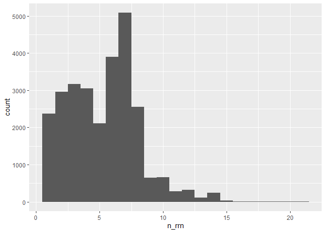
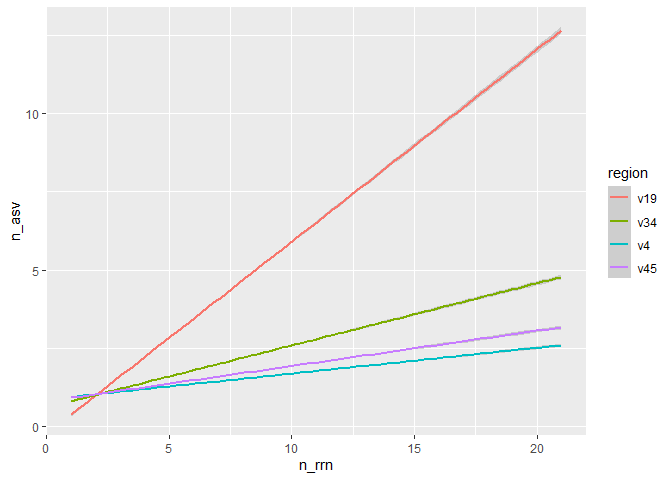
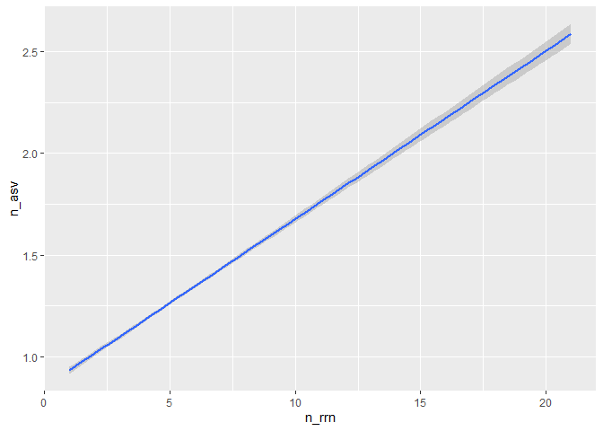

Analysing the sensitivity and specificity of ASVs for discriminating
between genomes
================
Callum Thomas
2022-09-30

``` r
library(tidyverse)
library(here)
library(scales)
```

### Need to determine the number of *rrn* operons across genomes.

Our analysis will use full length sequences:

``` r
fl <- read_tsv(here("data/v19/rrnDB.count_tibble"))
```

    ## Rows: 82533 Columns: 3
    ## ── Column specification ────────────────────────────────────────────────────────
    ## Delimiter: "\t"
    ## chr (2): asv, genome
    ## dbl (1): count
    ## 
    ## ℹ Use `spec()` to retrieve the full column specification for this data.
    ## ℹ Specify the column types or set `show_col_types = FALSE` to quiet this message.

How many rrn copies are in each genome?

``` r
fl %>% 
  group_by(genome) %>% 
  summarise(n_rrn = sum(count)) %>%
  ggplot(aes(x = n_rrn)) + geom_histogram(binwidth = 1)
```

<!-- -->

What do these numbers look like as a fraction of all genomes?

``` r
fl %>% 
  group_by(genome) %>% 
  summarise(n_rrn = sum(count)) %>%
  count(n_rrn) %>% 
  mutate(fraction = n/sum(n))
```

    ## # A tibble: 21 × 3
    ##    n_rrn     n fraction
    ##    <dbl> <int>    <dbl>
    ##  1     1  2367   0.0860
    ##  2     2  2961   0.108 
    ##  3     3  3165   0.115 
    ##  4     4  3051   0.111 
    ##  5     5  2109   0.0766
    ##  6     6  3903   0.142 
    ##  7     7  5082   0.185 
    ##  8     8  2552   0.0927
    ##  9     9   647   0.0235
    ## 10    10   653   0.0237
    ## # … with 11 more rows

We see that most genomes actually have more than one copy of the *rrn*
operon. I wonder if those different copies are the same sequence/ASV?

### What is the number of ASVs per genome?

Considering that most genomes have multiple copies of the *rrn* operon,
we need to know whether they all have the same ASV. Otherwise, we run
the risk of splitting a single genome into multiple ASVs.

``` r
fl %>%
  group_by(genome) %>% 
  summarise(n_asv = n(), n_rrn = sum(count)) %>% 
  group_by(n_rrn) %>% 
  summarise(med_n_asv = median(n_asv),
            lq_n_asv = quantile(n_asv, prob=0.25),
            uq_n_asv = quantile(n_asv, prob = 0.75))
```

    ## # A tibble: 21 × 4
    ##    n_rrn med_n_asv lq_n_asv uq_n_asv
    ##    <dbl>     <dbl>    <dbl>    <dbl>
    ##  1     1         1        1        1
    ##  2     2         1        1        2
    ##  3     3         1        1        2
    ##  4     4         1        1        2
    ##  5     5         3        1        4
    ##  6     6         2        1        4
    ##  7     7         4        3        6
    ##  8     8         5        3        7
    ##  9     9         7        5        8
    ## 10    10         7        4        9
    ## # … with 11 more rows

``` r
fl %>%
  group_by(genome) %>% 
  summarise(n_asv = n(), n_rrn = sum(count)) %>% 
  ggplot(aes(x = n_rrn, y = n_asv)) + geom_smooth(method = "lm")
```

    ## `geom_smooth()` using formula 'y ~ x'

<!-- -->

Surprisingly, the number of ASVs increases at a rate of about 2 ASVs per
3 copies of the *rrn* operon in the genome.

### How many genomes does each ASV appear in?

Are ASVs unique to genomes they are found in?

``` r
(ASV_per_genome <- fl %>% 
  group_by(asv) %>% 
  summarise(n_genome = n()) %>% 
  count(n_genome) %>% 
  mutate(fraction = n/sum(n)))
```

    ## # A tibble: 141 × 3
    ##    n_genome     n fraction
    ##       <int> <int>    <dbl>
    ##  1        1 32421  0.826  
    ##  2        2  3328  0.0847 
    ##  3        3  1144  0.0291 
    ##  4        4   605  0.0154 
    ##  5        5   337  0.00858
    ##  6        6   252  0.00642
    ##  7        7   166  0.00423
    ##  8        8   112  0.00285
    ##  9        9    99  0.00252
    ## 10       10    82  0.00209
    ## # … with 131 more rows

We see that (for full-length sequences) 82.56 % of ASVs were unique to a
genome.

#### Does sensitivity and specificity change if we look at a shorter region?

Previously we looked at full-length sequences that span the entire range
of the gene (V1-9). What if we just look at the V4 region?

We know that the V4 region is less diverse than the full-length
sequence, so does the number of ASVs per genome differ? Are ASVs as
specific in this region?

``` r
v4 <- read_tsv(here("data/v4/rrnDB.count_tibble"))
```

    ## Rows: 35811 Columns: 3
    ## ── Column specification ────────────────────────────────────────────────────────
    ## Delimiter: "\t"
    ## chr (2): asv, genome
    ## dbl (1): count
    ## 
    ## ℹ Use `spec()` to retrieve the full column specification for this data.
    ## ℹ Specify the column types or set `show_col_types = FALSE` to quiet this message.

``` r
v4 %>%
  group_by(genome) %>% 
  summarise(n_asv = n(), n_rrn = sum(count)) %>% 
  group_by(n_rrn) %>% 
  summarise(mean_n_asv = mean(n_asv),
            lq_n_asv = quantile(n_asv, prob=0.25),
            uq_n_asv = quantile(n_asv, prob = 0.75))
```

    ## # A tibble: 21 × 4
    ##    n_rrn mean_n_asv lq_n_asv uq_n_asv
    ##    <dbl>      <dbl>    <dbl>    <dbl>
    ##  1     1       1           1        1
    ##  2     2       1.08        1        1
    ##  3     3       1.09        1        1
    ##  4     4       1.16        1        1
    ##  5     5       1.31        1        1
    ##  6     6       1.25        1        1
    ##  7     7       1.37        1        1
    ##  8     8       1.55        1        2
    ##  9     9       1.60        1        2
    ## 10    10       1.80        1        2
    ## # … with 11 more rows

``` r
v4 %>%
  group_by(genome) %>% 
  summarise(n_asv = n(), n_rrn = sum(count)) %>% 
  ggplot(aes(x = n_rrn, y = n_asv)) + geom_smooth(method = "lm")
```

    ## `geom_smooth()` using formula 'y ~ x'

<!-- -->

The number of ASVs per copy of the *rrn* operon is lower than for
full-length sequences. We find 1.5 ASVs per 10 copies of the *rrn*
operon.

How many genomes does each ASV appear in for the V4 region?

``` r
(v4_ASV_per_genome <- v4 %>% 
  group_by(asv) %>% 
  summarise(n_genome = n()) %>% 
  count(n_genome) %>% 
  mutate(fraction = n/sum(n)))
```

    ## # A tibble: 111 × 3
    ##    n_genome     n fraction
    ##       <int> <int>    <dbl>
    ##  1        1  7165  0.751  
    ##  2        2  1022  0.107  
    ##  3        3   399  0.0418 
    ##  4        4   209  0.0219 
    ##  5        5   129  0.0135 
    ##  6        6    94  0.00986
    ##  7        7    62  0.00650
    ##  8        8    46  0.00482
    ##  9        9    39  0.00409
    ## 10       10    36  0.00378
    ## # … with 101 more rows

We find that about 75.14% of ASVs from the V4 region are specific to one
genome.

#### To be determined:

-   Can we correct for overrepresentation?
-   Consider analysis at species, genus, family, etc. levels?
-   Consider more broad definition of an ASV
