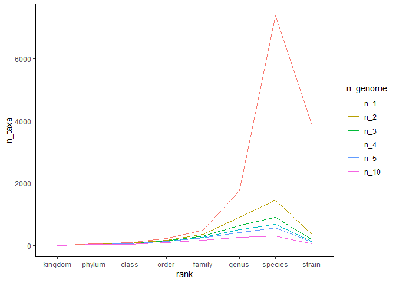

Analysing distribution of genomes across different taxonomic ranks
================
Callum Thomas
2022-10-05

``` r
library(tidyverse)
library(here)
```

``` r
metadata <- read_tsv(here("data/references/genome_id_taxonomy.tsv"),
                     col_types = cols(.default = col_character())) %>% 
  mutate(strain = if_else(species == scientific_name, NA_character_, scientific_name)) %>% 
  select(-scientific_name) %>% 
  pivot_longer(-genome_id, names_to="rank", values_to="taxon") %>% 
  drop_na(taxon) %>% 
  mutate(rank = factor(rank,
                       levels = c("kingdom", "phylum", "class", "order", 
                                  "family", "genus", "species", "strain")))

asv <- read_tsv(here("data/processed/rrnDB.count_tibble"),
                col_types = cols(.default = col_character(),
                                 count = col_integer()))

metadata_asv <- inner_join(metadata, asv, by=c("genome_id" = "genome"))
```

### Find the number of taxa within each taxonomic rank

``` r
n_taxa_per_rank <- metadata_asv %>% 
  filter(region == "v19") %>% 
  group_by(rank, taxon) %>% 
  summarise(N = n_distinct(genome_id)) %>% 
  summarise(n_1 = n_distinct(taxon),
            n_2 = sum(N >=2),
            n_3 = sum(N >=3),
            n_4 = sum(N >=4),
            n_5 = sum(N >=5),
            n_10 = sum(N >=10)) %>% 
  pivot_longer(-rank, names_to = "n_genome", values_to = "n_taxa") %>% 
  mutate(n_genome = factor(n_genome, 
                           levels = c("n_1", "n_2", "n_3",
                                      "n_4", "n_5", "n_10")))
  
n_taxa_per_rank %>% 
  ggplot(aes(x=rank, y=n_taxa, group=n_genome, color=n_genome)) +
    geom_line() +
    theme_classic()
```

<!-- -->

-   Even if we require that every taxonomic group had at least 5
    genomes, there would be a few hundred species represented.
-   Not sure the strain level data is complete, there may be taxa in the
    “strain” rank that did not have the strain correctly indicated.
