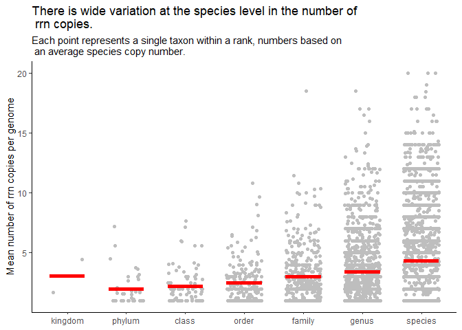

Quantifying the number of *rrn* operons across taxonomic ranks
================
Callum Thomas
2022-10-29

``` r
library(tidyverse)
library(here)
```

``` r
metadata <- read_tsv(here("data/references/genome_id_taxonomy.tsv"),
                     col_types = cols(.default = col_character())) %>% 
  mutate(strain = if_else(species == scientific_name, NA_character_, scientific_name)) %>% 
  select(-scientific_name)

asv <- read_tsv(here("data/processed/rrnDB.count_tibble"),
                col_types = cols(.default = col_character(),
                                 count = col_integer()))

metadata_asv <- inner_join(metadata, asv, by=c("genome_id" = "genome"))
```

### Plot the number of *rrn* copies per taxonomic rank

Our analysis will use full length sequences (v19). We want to count and
plot the number of coppies per *taxonomic rank*. Before calculating the
averages for each of these ranks, we should first get an average number
of copies for each species. This will allow us to control for the uneven
number of genomes in each species.

``` r
rrn_per_taxon <- metadata_asv %>% 
  filter(region=="v19") %>% 
  group_by(kingdom, phylum, class, order,
           family, genus, species, genome_id) %>% 
  summarise(n_rrns = sum(count), .groups = "drop") %>% 
  group_by(kingdom, phylum, class, order,
           family, genus, species) %>% 
  summarise(mean_rrns = mean(n_rrns), .groups = "drop") %>% 
  pivot_longer(-mean_rrns, 
               names_to = "rank", 
               values_to = "taxon") %>% 
  drop_na(taxon) %>% 
  mutate(rank = factor(rank, 
                       levels=c("kingdom", "phylum",
                                "class", "order",
                                "family", "genus",
                                "species", "strain"))) %>% 
  group_by(rank, taxon) %>% 
  summarise(mean_rrns = mean(mean_rrns), .groups = "drop")

mean_of_means <- rrn_per_taxon %>% 
  group_by(rank) %>% 
  summarise(mean_mean_rrns = mean(mean_rrns), .groups = "drop")

rrn_per_taxon %>% 
  ggplot(aes(x = rank, y = mean_rrns)) +
  geom_jitter(width = 0.3, color = "grey") +
  geom_segment(data = mean_of_means,
               aes(x = 1:7-0.3, xend = 1:7+0.3,
                   y = mean_mean_rrns, yend = mean_mean_rrns),
               color = "red", group = 1, size = 2) +
  theme_classic() +
  labs(x = NULL, 
       y = "Mean number of rrn copies per genome",
       title = "There is wide variation at the species level in the number of\n rrn copies.",
       subtitle = "Each point represents a single taxon within a rank, numbers based on\n an average species copy number.")
```

<!-- -->

Bacteria have more copies than Archaea, even after correcting for number
of genomes per species. There was wide variation in the number of *rrn*
operons per taxonomic group.

Here’s another way of looking at the data:

``` r
library(ggridges)
```

    ## Warning: package 'ggridges' was built under R version 4.2.2

``` r
median_of_means <- rrn_per_taxon %>% 
  group_by(rank) %>% 
  summarise(median_mean_rrns = median(mean_rrns), .groups = "drop")

n_ranks <- nrow(median_of_means)

rrn_per_taxon %>% 
  ggplot(aes(y = rank, x = mean_rrns)) +
  geom_density_ridges(stat="binline", binwidth = 1, scale = 0.9) +
  geom_point(data = median_of_means,
               aes(x = median_mean_rrns, y = 1:n_ranks+0.1),
               color = "red", group = 1, size = 2) +
  theme_classic() +
  labs(y = NULL, 
       x = "Mean number of rrn copies per genome",
       title = "The distribution of rrn copies per genome is fairly consistent across ranks.",
       subtitle = "Each point represents a single taxon within a rank, numbers based on\n an average species copy number. The dot represents the median for the rank.")
```

<!-- -->
